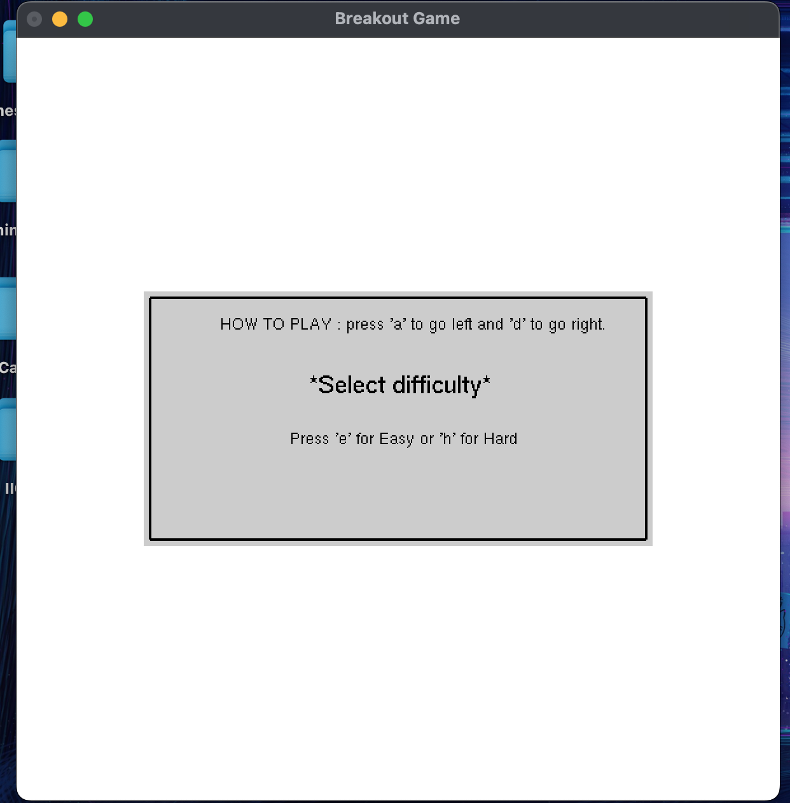
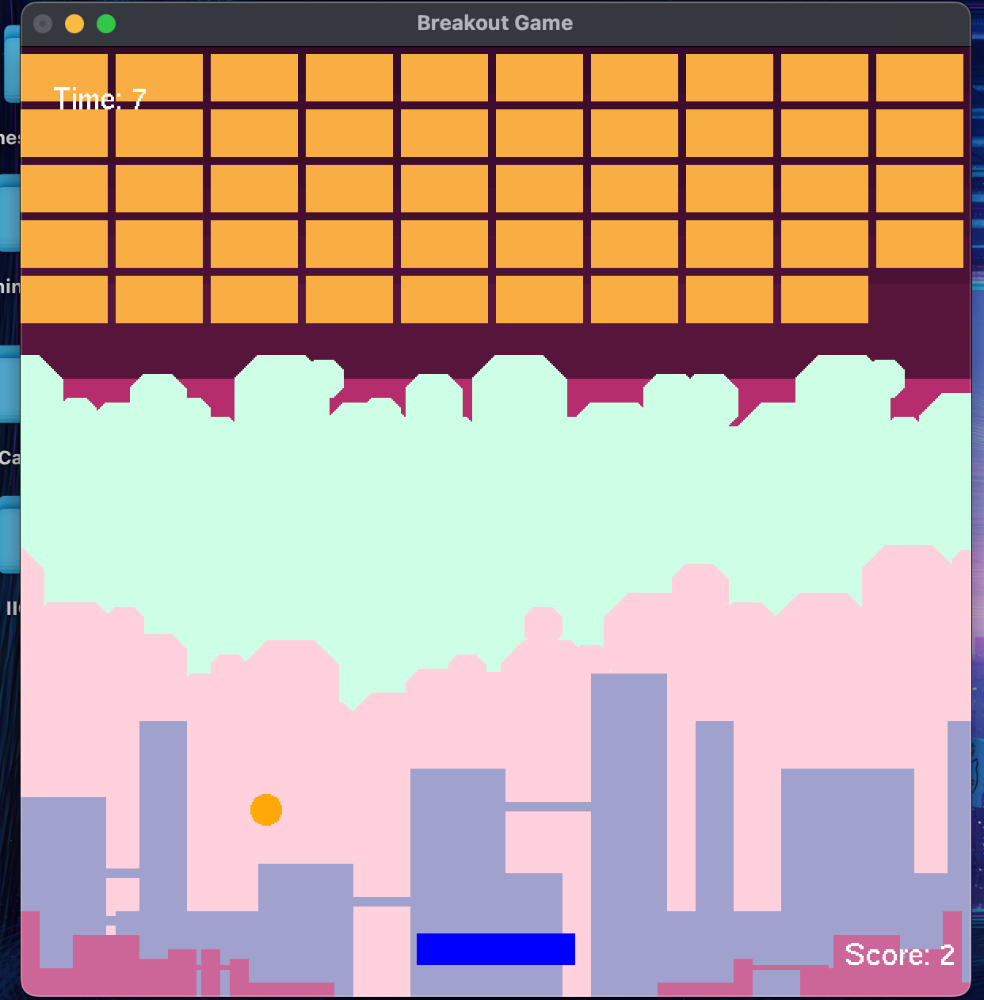
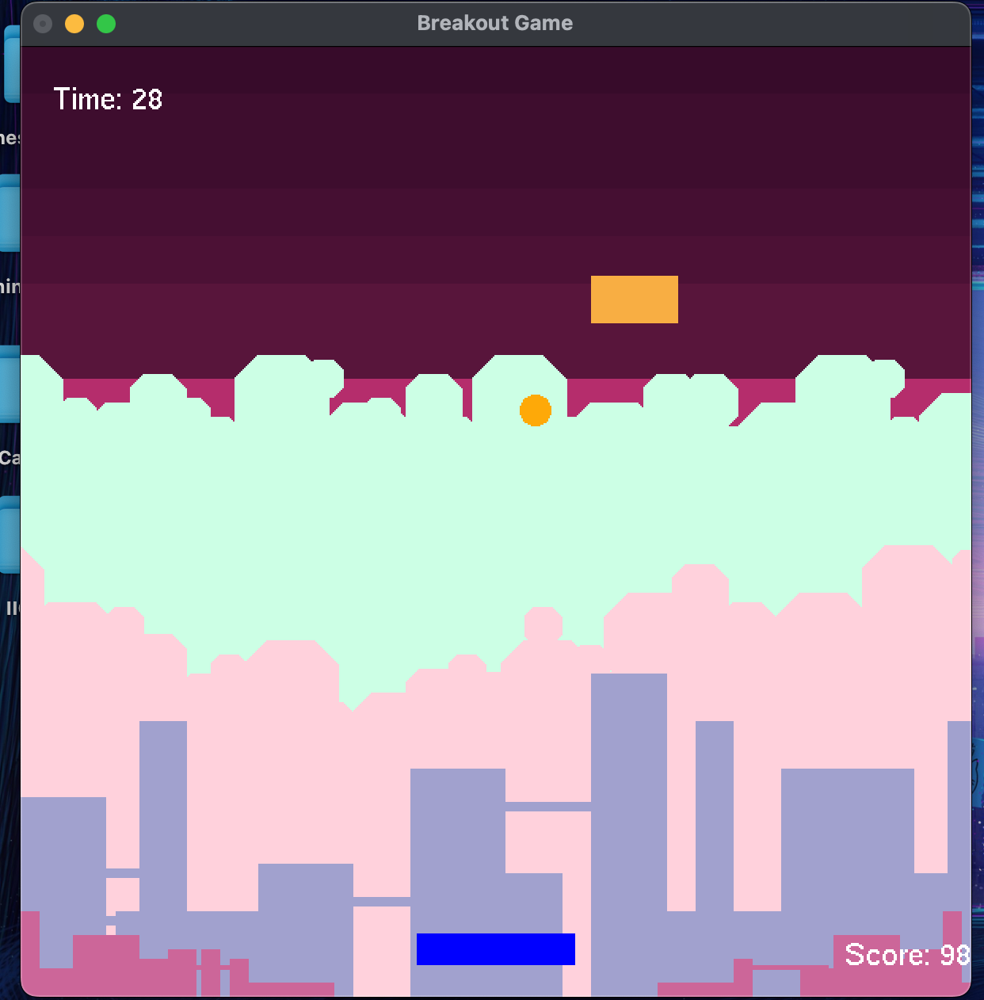
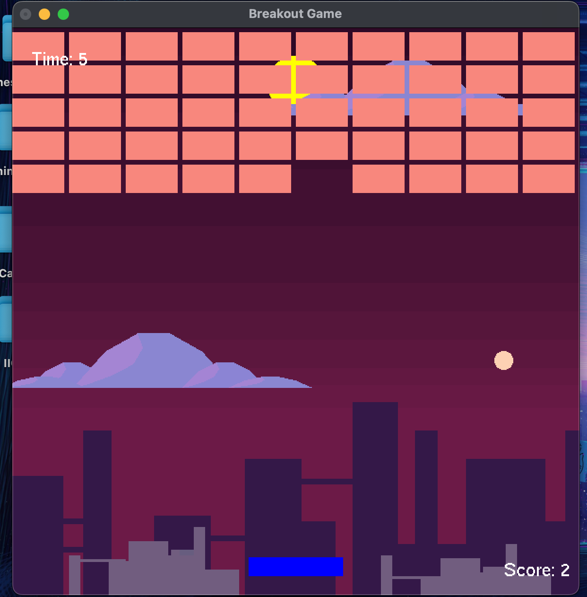
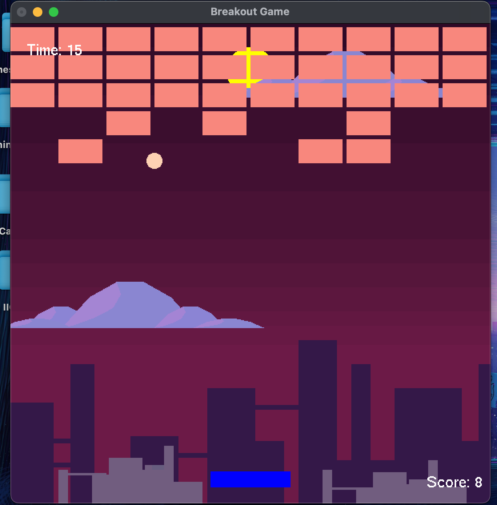
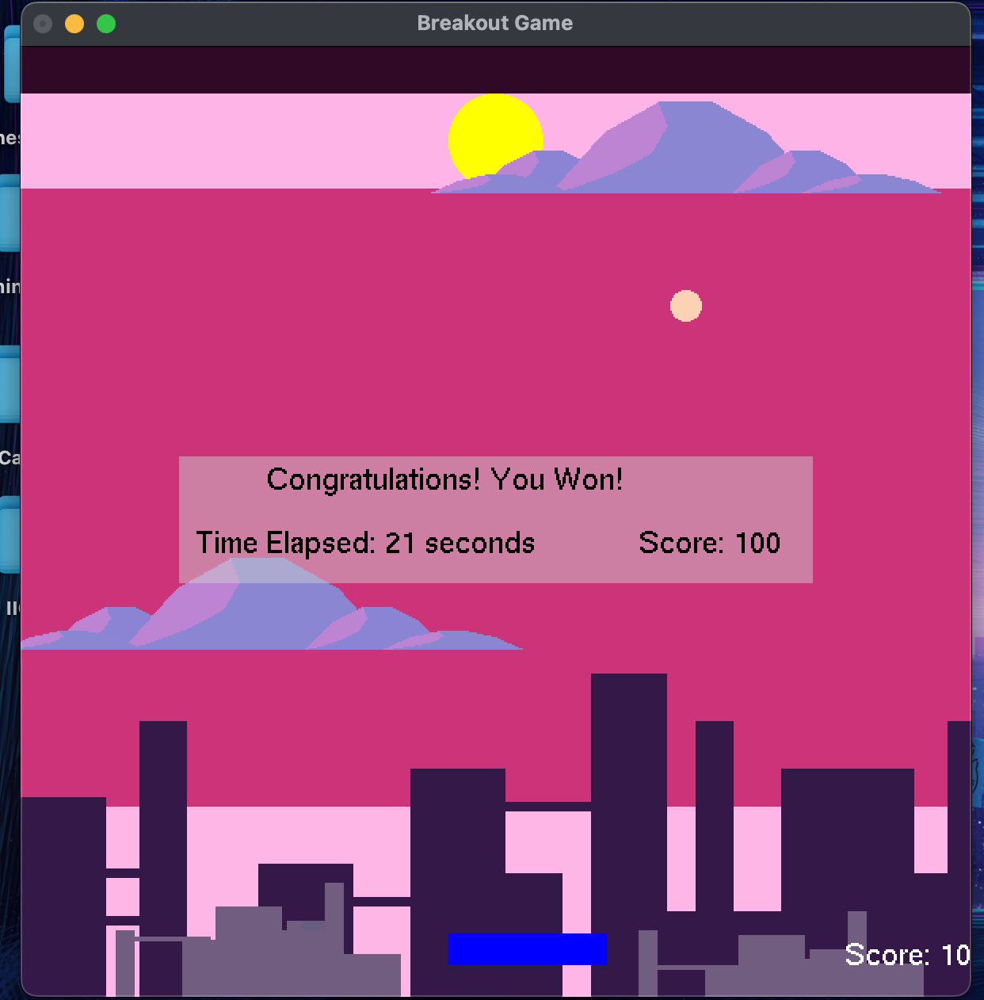
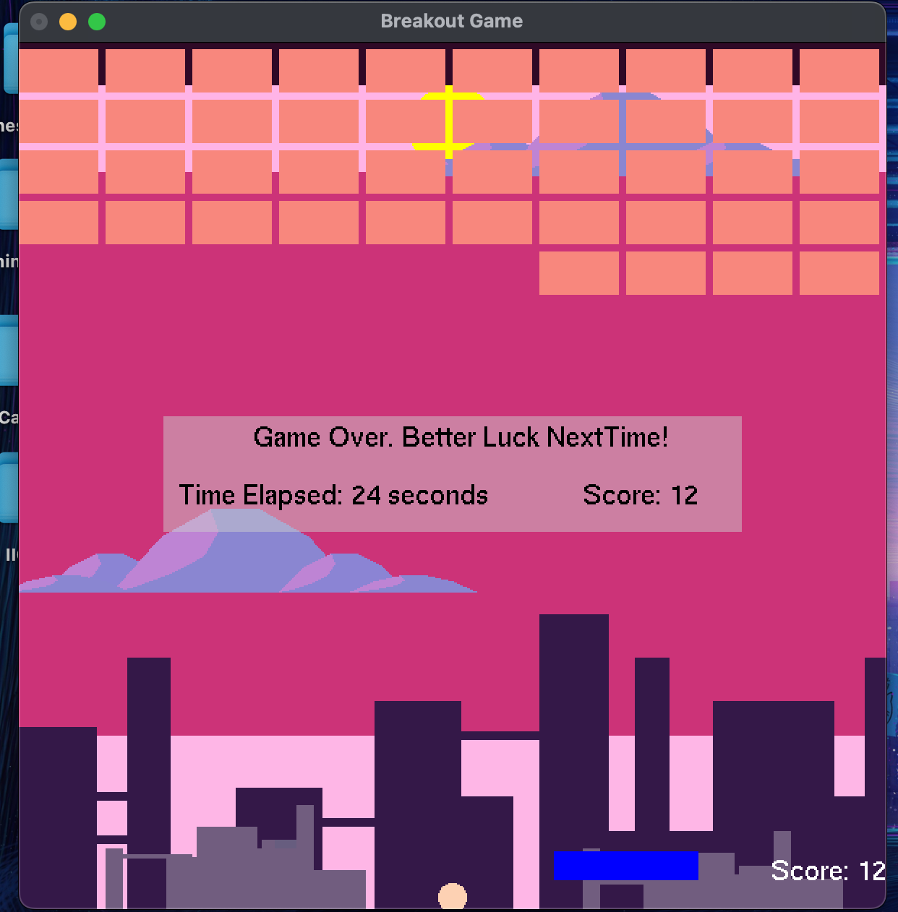

# 🎮 Breakout Game – OpenGL & GLUT Edition

A colorful and interactive implementation of the classic Breakout game using **OpenGL** and **GLUT**, designed and developed in **Xcode (macOS)** with compatibility on **Windows (Code::Blocks)**. Players control a paddle to bounce a ball and break bricks, with difficulty modes that dynamically affect gameplay visuals and mechanics.

---

## Features

- 🧱 Brick-breaking gameplay with a responsive paddle and bouncing ball.
- 🎨 Easy and Hard difficulty modes with distinct backgrounds and color themes.
- ⏱️ Real-time timer and score tracking displayed in-game.
- 💥 Game result popups with animation and transparency effects.
- 🎮 Intuitive keyboard controls for gameplay and difficulty selection.
- ☁️ Decorative graphics like clouds and custom shapes enhance visual appeal.

---

## Tools & Technologies

- **Language:** C
- **Graphics:** OpenGL & GLUT
- **Development Environment:**
  - macOS: Xcode
  - Windows: Code::Blocks

---

## Gameplay Overview

- **Goal:** Destroy all bricks by bouncing a ball off a paddle without letting it fall.
- **Win Condition:** All bricks cleared.
- **Lose Condition:** Ball drops below the paddle.

---

## Controls

| Key | Action |
|-----|--------|
| `e` | Select Easy Mode |
| `h` | Select Hard Mode |
| `a` | Move Paddle Left |
| `d` | Move Paddle Right |
| `Esc` | Exit the Game |

---

## Core Components

- `drawPaddle()` – Draws the paddle with blue color.
- `drawBall()` – Renders the ball with difficulty-dependent color.
- `drawBrick()` – Draws a single brick; color changes with difficulty.
- `drawBricks()` – Renders the full grid of bricks.
- `drawPopup()` – Displays game result or instructions.
- `drawEasyBackground()` & `drawHardBackground()` – Unique backgrounds based on difficulty.
- `update()` – Main game logic: collision detection, movement, score, win/loss checks.
- `keyboard()` – Keyboard input handling.
- `main()` – GLUT initialization and event loop setup.

---

## Customization Ideas

- Add unique background themes and effects.
- Design personalized bricks and paddle shapes.
- Tweak animations and transitions.
- Implement multiplayer or advanced scoring mechanics.

---

## My Role & Contributions

This project was built collaboratively, and I focused on:
- Core gameplay mechanics: paddle movement, ball dynamics, and collision logic.
- Implementing the real-time scoring and game state logic.
- Designing a difficulty selection system that changes visual styles and gameplay behavior.

---

## Screenshots

### Main Menu


### Easy Mode Gameplay




### Hard Mode Gameplay




### You Win!


### Game Over


---

## Run the Project

### Clone the repo:
   ```bash
   git clone --depth 1 --filter=blob:none --sparse https://github.com/bla999ckt/PixelCraft.git
   cd PixelCraft/C_and_OpenGl
   git sparse-checkout set breakout%20game
   cd breakout%20game
   ```

### Requirements

To run this program, you’ll need:

- A C compiler (`gcc`, `clang`, or MSVC)
- OpenGL libraries
- FreeGLUT (or GLUT) installed

## 💻 How to Compile & Run

### 🐧 Linux
```bash
sudo apt update
sudo apt install freeglut3-dev build-essential
gcc main.c -o main -lglut -lGLU -lGL
./main
```
### 🍎 macOS (with Homebrew)
```bash
brew install freeglut
gcc main.c -o main -framework OpenGL -framework GLUT
./main
```
### 🪟 Windows (MinGW + FreeGLUT)
1. Install MinGW and FreeGLUT.
2.Place freeglut.dll in the same folder as your executable.
3. Compile using:
```bash
gcc main.c -o main.exe -lfreeglut -lopengl32 -lglu32
main.exe
```
You may need to adjust include paths if your GLUT headers/libraries are in non-default locations.
---

## Future Improvements

- Add sound effects and background music.
- Create level progression and increasing difficulty.
- Introduce power-ups like multi-ball or extended paddle.
- Add saving high scores or pause/resume features.

---

## 🧾 License

MIT License 

---

## Acknowledgements

Thanks to my teammates and mentors who contributed ideas, graphics, and feedback throughout development!
