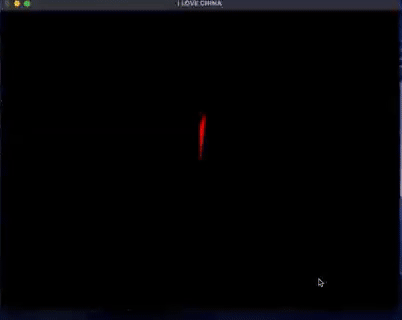

# ❤️ Chinese Heart - OpenGL Animation

A creative graphical animation built with OpenGL and FreeGLUT on macOS using Xcode, featuring a heart-shaped figure adorned with the Chinese flag. The heart rotates smoothly, with glowing stars appearing dynamically to complete the scene.



## 🌟 Features

- Smooth rotation animation of the heart
- Dynamic glowing stars inspired by the Chinese flag
- Visually aesthetic transition between static and rotating heart
- Fully customizable: colors, speed, background, and more

## 🛠 Tools & Technologies

- **Language**: C
- **Libraries**: OpenGL, FreeGLUT
- **Platform**: macOS (developed using Xcode)

## 🔧 How It Works

The program is composed of several modular functions:

- `drawHeart()` – Draws the heart shape with customizable color
- `drawStar()` – Draws individual stars with scalable size
- `drawStarsOnFirstHeart()` – Places stars around the static heart
- `drawRotatingHeart()` – Manages heart rotation logic
- `drawBackground()` – Sets the background color
- `display()` – Main display handler with transitions
- `timer()` – Handles timing and scene updates
- `reshape()` – Adapts the viewport on window resize

## 🎮 Interactive Ideas

Want to customize your version?

- 🎨 Change heart color: Modify RGB in `glColor3f()` in `drawHeart()`
- ⏩ Speed up or slow down animation: Tweak `angle +=` in `display()`
- 🌠 Redesign star positions: Play around in `drawStarsOnFirstHeart()`
- 🎭 Add transitions: Modify `timer()` for fade or spin effects
- 🖱 Add input: Scale the heart using keyboard/mouse events
- 🌌 Background mood: Change background color in `drawBackground()`

## 🧪 Run the Project

### Clone the repo:
   ```bash
   git clone --depth 1 --filter=blob:none --sparse https://github.com/bla999ckt/PixelCraft.git
   cd PixelCraft/C_and_OpenGl
   git sparse-checkout set heart
   cd heart
   ```

### 🛠 Requirements

To run this program, you’ll need:

- A C compiler (`gcc`, `clang`, or MSVC)
- OpenGL libraries
- FreeGLUT (or GLUT) installed

## 💻 How to Compile & Run

### 🐧 Linux
```bash
sudo apt update
sudo apt install freeglut3-dev build-essential
gcc main.c -o main -lglut -lGLU -lGL
./main
```
### 🍎 macOS (with Homebrew)
```bash
brew install freeglut
gcc main.c -o main -framework OpenGL -framework GLUT
./main
```
### 🪟 Windows (MinGW + FreeGLUT)
1. Install MinGW and FreeGLUT.
2.Place freeglut.dll in the same folder as your executable.
3. Compile using:
```bash
gcc main.c -o main.exe -lfreeglut -lopengl32 -lglu32
main.exe
```
You may need to adjust include paths if your GLUT headers/libraries are in non-default locations.

## 🧠 What I Learned

- Mastered OpenGL basics for 2D graphics
- Worked with transformation matrices and real-time animation
- Improved my creative problem-solving and debugging skills
- Gained deeper insights into mixing code with artistic design

## 📌 Known Issues

- Initial versions had trouble aligning stars properly — now resolved.
- Rotation speed may vary on different systems. Easily adjustable!

## 🚀 Future Enhancements

- Add user-controlled heart scaling and direction toggle
- Integrate music or sound effects for immersion
- Implement interactive GUI controls


---

> "I LOVE CHINA" is not just a message — it’s a moving picture, a digital heartbeat. ❤️🇨🇳
