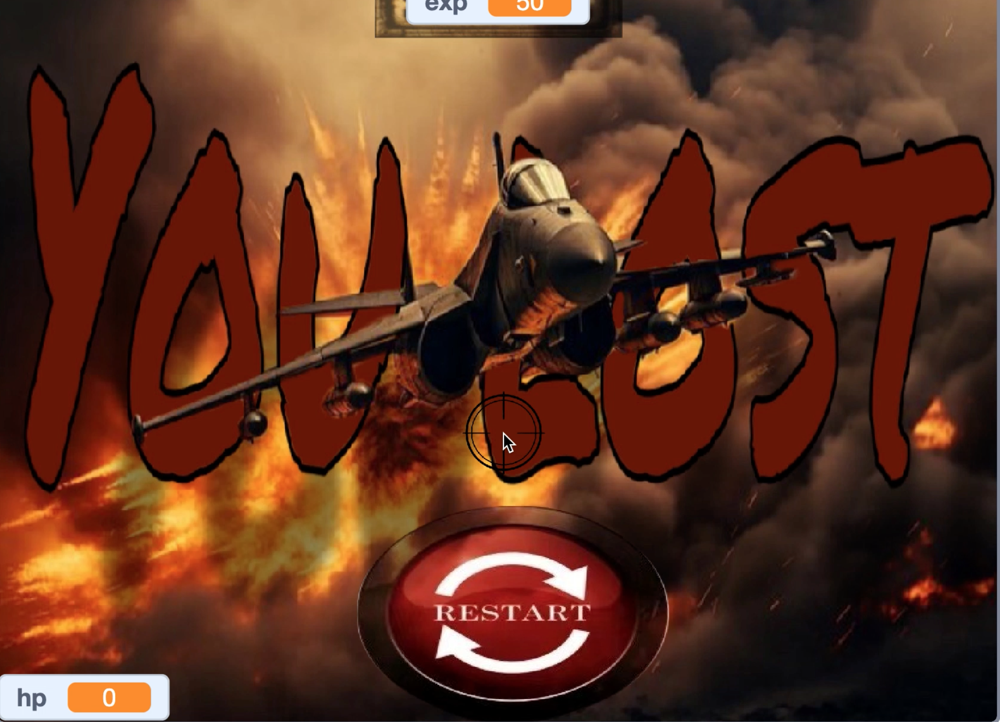

# ShellStorm

ShellStorm is an intense wartime shooter game where players command heavy artillery to defend against waves of enemy aircraft. The game is designed to provide an exciting and challenging experience, featuring various difficulty levels, realistic artillery mechanics, and engaging gameplay.

## Features

- **Multiple Difficulty Levels**: Adjust the difficulty to suit your gameplay style.
- **Wave-based Gameplay**: Face waves of enemy aircraft that get progressively harder.
- **Realistic Artillery Mechanics**: Control powerful artillery and defend your territory from incoming threats.
- **Engaging Visuals**: Enjoy the immersive battle scenes with cool animations and effects.

## Installation

To play **ShellStorm** on your local machine:

1. Visit the [Scratch website](https://scratch.mit.edu/) and search for "ShellStorm" or visit the project page directly, or visit [Shellstorm](https://scratch.mit.edu/projects/1125060276) directly
2. Click the "See Inside" button to view the source code, or simply click the green flag to start the game.
3. No installation is required – everything runs directly in the browser!

## How to Play

- **Control the artillery**: Use the arrow keys or mouse to aim and fire the artillery.
- **Defend against waves of enemy aircraft**: Destroy as many enemies as you can to survive.
- **Progress through levels**: As you defeat enemies, new levels with more difficult enemies will appear.
- **Watch out for incoming missiles**: Avoid getting hit by enemy missiles while trying to take down aircraft.

## Screenshots

## Credits

- **Developer**: blackt
- **Platform**: Scratch

## Contact

For any questions, suggestions, or contributions, feel free to contact me through GitHub or email.

---

Enjoy playing **ShellStorm**, and may your artillery always hit its mark!
