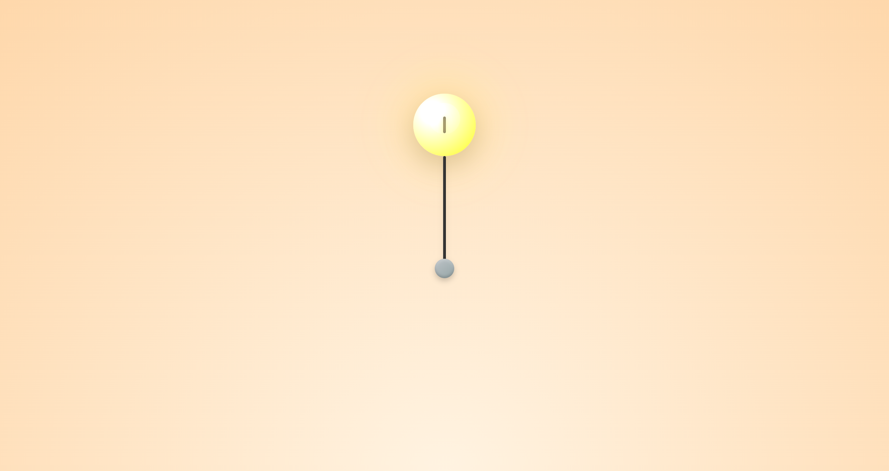

# Bulb

An interactive web project that simulates a pull chain light fixture. Toggle the light by clicking or tapping the chain's handle, which animates the cord and changes the bulb's appearance along with the background.




## Overview

This project features:
- A realistic lightbulb with dynamic gradients, reflections, and shadows.
- A pull chain mechanism that uses keyframe animations for a smooth pull-down and pull-up effect.
- A dynamic background that changes based on the light's on/off state.
- A responsive design that centers the scene on the page.

## Features

- **Interactive Pull Chain:** Click or tap the handle to toggle the light.
- **Smooth Animations:** Enjoy keyframe-based animations for the cord and handle.
- **Dynamic Visuals:** The bulb and background update their appearance to mimic a real light fixture.
- **Responsive Layout:** Centered layout using Flexbox ensures the scene looks great on any device.

## Installation

No build tools or dependencies are required. Simply clone or download the repository and open the `bulb.html` file in your favorite web browser.

```bash
git clone https://github.com/yourusername/bulb.git
cd bulb
open bulb.html
```

## Usage

1. Open the `bulb.html` file in your web browser.
2. Click or tap the handle below the bulb.
3. Watch as the cord animates and the light toggles on and off.

## Code Structure

- **HTML:** Contains the layout for the bulb, cord, and handle within a centered scene.
- **CSS:** Uses custom properties for colors and gradients, along with keyframe animations (`pullDown` and `pullUp`) for the cord.
- **JavaScript:** A simple script that toggles the bulb’s state, changes the background, and applies the appropriate animations when the handle is activated.

## Customization

- **CSS Variables:** Modify colors, gradients, and shadows in the `:root` section to personalize the design.
- **Animations:** Adjust the `@keyframes pullDown` and `@keyframes pullUp` to change the cord animation behavior.
- **Layout:** The scene is centered using Flexbox; feel free to update the layout as needed.

## License

This project is open source and available under the [MIT License](LICENSE).
